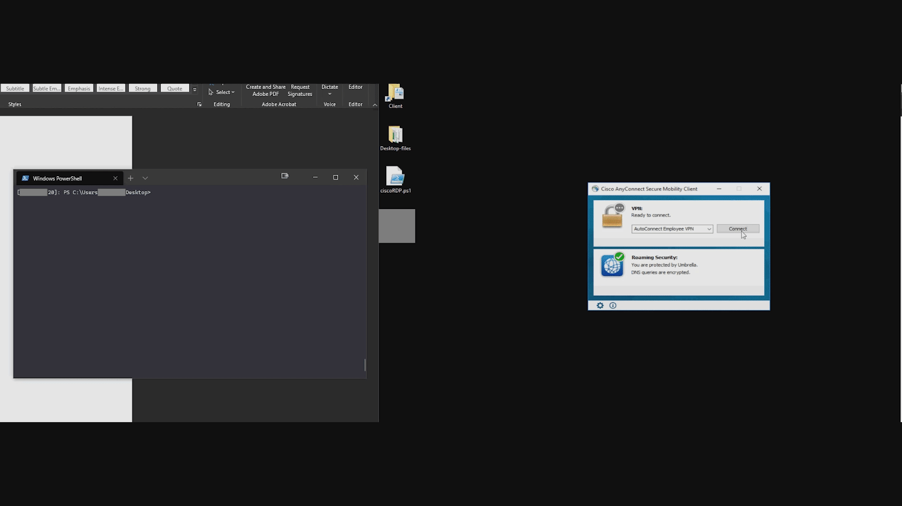

# ciscoRDP
A powershell POC to bypass “AllowRemoteUsers” setting set in Cisco Adaptive Security Device Manager (ASDM)

## Overview

This vulnerability was manifested by my laziness for carrying too many laptops. When using Cisco AnyConnect Secure Mobility Client to connect to a vpn, AnyConnect checks if the connection is being initiated from a Remote Desktop session. If an orgainzation has the "AllowRemoteUsers" setting set to deny in ASDM, Anyconnect will block the connection. However, due to a bug in the checking process it is possible to bypass that restriction. Cisco says this vulnerability is a low and a security advisory isn't warranted instead they will add to the release notes of bug CSCvu14970, so here's the tool.

Vulnerability has been reported to Cisco PSIRT on: 05/04/2020

### Note
If Company XYZ has autoconnect configured for their clients the script will autoconnect to the network bypassing the Remote Desktop Check and authentication.

## Usage
A user session must be active if not, RDP to the machine and then run the script. An interactive remote shell will be needed to run the script as it will need to be killed once the VPN connects. WinRM works perfectly with this.
* If script kills anyconnect but doesn't connect to vpn, re-run as it may take 2 or 3 times.

## Demo

## Affected Versions
Affects Cisco AnyConnect Secure Mobility Client 4.8.x and prior
